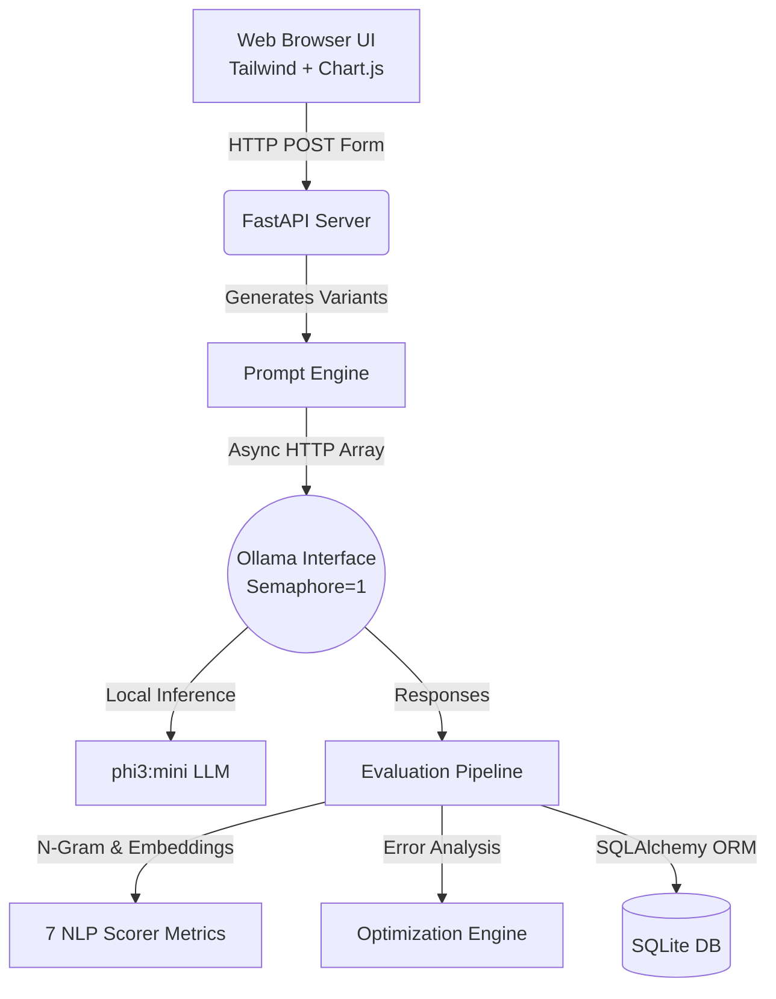

<div align="center">
  
  # 🧪 LLM Evaluation & Prompt Optimization System
  
  **Evaluate. Compare. Optimize.**<br>
  *A production-grade, 100% local toolchain to test LLM prompts against 7 advanced NLP metrics.*
</div>

---

## 🎯 Problem Statement
When developing LLM applications, **prompt engineering is often guesswork**. Developers lack a systematic way to:
1. **Objectively compare** different prompt engineering strategies.
2. **Quantifiably measure** response quality using hard NLP metrics.
3. **Automatically improve** prompts based on strict data analysis.

**This system solves all three problems.** By combining an async FastAPI backend, an Ollama local LLM engine, and a suite of NLP scoring algorithms (BLEU, ROUGE, Cosine Similarity), it provides a complete framework for structured prompt optimization.

## ✨ Key Features
- **🚀 100% Local Inference**: Runs locally via Ollama (default: `phi3:mini`) with zero API costs.
- **🚥 7-Metric Evaluation Engine**: Scores responses against BLEU, ROUGE-L, Semantic Relevance, Entity Coverage, Formatting Structure, Run-to-Run Consistency, and an LLM-as-a-Judge.
- **🤖 Automated Prompt Optimization**: Identifies weaknesses (e.g., hallucination, missing entities, verbosity) and automatically generates an improved prompt strategy.
- **⚡ Asynchronous Architecture**: Utilizes `asyncio.Semaphore` and `httpx` to handle parallel prompt evaluations without deadlocking the open-source LLM engine.
- **🎛️ "Lumina Eval" UI**: A premium, responsive dashboard built with Jinja2, Tailwind CSS (glassmorphism design), and Chart.js for data visualization.

---

## 🏗️ System Architecture



## 🛠️ Technology Stack
| Layer | Technology | Justification |
|-------|------------|---------------|
| **Backend** | Python, FastAPI, Uvicorn | High-performance async request handling |
| **LLM Engine** | Ollama | Secure, cost-free local open-weight inference |
| **NLP/ML** | NLTK, rouge-score, sentence-transformers | Industry standard metric calculation |
| **Database** | SQLite, SQLAlchemy | Lightweight embedded persistence with ORM reliability |
| **Frontend** | HTML5, Tailwind CSS, Jinja2, Chart.js | SSR architecture with zero heavy JS framework hydration |

---

## 📦 Run Locally

### 1. Prerequisites
- Python 3.10+
- [Ollama](https://ollama.ai) installed and running in the background.

### 2. Setup
```bash
# Clone the repository
git clone https://github.com/RAGHUME/llm-eval-system.git
cd llm-eval-system

# Create virtual environment and install dependencies
python -m venv venv
.\venv\Scripts\activate
pip install -r requirements.txt

# Download required NLTK tokenizers
python -c "import nltk; nltk.download('punkt_tab'); nltk.download('averaged_perceptron_tagger_eng'); nltk.download('stopwords')"

# Pull the lightweight model (2.3GB)
ollama pull phi3:mini
```

### 3. Start the Server
```bash
python -m uvicorn main:app --reload --port 8000
```
Open **[http://localhost:8000](http://localhost:8000)** in your browser!

---

## 📂 Project Structure
```text
llm-eval-system/
├── core/                  # Database models, LLM connection, and prompt generation
├── evaluation/metrics/    # 7 independent scoring algorithms (BLEU, ROUGE, Relevance, etc.)
├── analysis/              # Error detection and hallucination flagging
├── optimization/          # Automated iterative prompt improvement loop
├── api/                   # FastAPI route handlers (Main, Evaluate, Optimize, History)
├── templates/             # Server-side rendered Jinja2 templates (Lumina UI)
└── main.py                # Application entry point
```

## 🚀 Status
✅ **Production Ready** — Evaluator, auto-optimizer, and UI are fully built, thoroughly linted, and verified.

*Built by [RAGHUME](https://github.com/RAGHUME) to demonstrate advanced GenAI toolchain engineering.*
