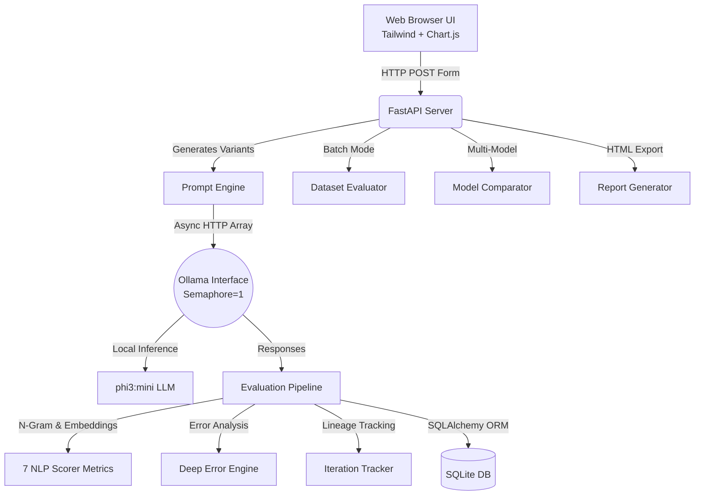

<div align="center">
  
  # 🧪 LLM Evaluation & Prompt Optimization System
  
  **Evaluate. Compare. Optimize. Report.**<br>
  *A production-grade, 100% local toolchain to test LLM prompts against 7 advanced NLP metrics.*

  [](https://python.org)
  [](https://fastapi.tiangolo.com)
  [](https://ollama.ai)
  [](LICENSE)
  [](#)
</div>

---

## 🎯 Problem Statement
When developing LLM applications, **prompt engineering is often guesswork**. Developers lack a systematic way to:
1. **Objectively compare** different prompt engineering strategies.
2. **Quantifiably measure** response quality using hard NLP metrics.
3. **Automatically improve** prompts based on strict data analysis.

**This system solves all three problems.** By combining an async FastAPI backend, an Ollama local LLM engine, and a suite of NLP scoring algorithms (BLEU, ROUGE, Cosine Similarity), it provides a complete framework for structured prompt optimization.

## ✨ Key Features

### Core Engine (Phase 1)
| Feature | Description |
|---------|-------------|
| 🚀 **100% Local Inference** | Runs locally via Ollama (default: `phi3:mini`) with zero API costs |
| 🚥 **7-Metric Scoring Engine** | BLEU, ROUGE-L, Semantic Relevance, Entity Coverage, Structure, Consistency, LLM-as-a-Judge |
| 🤖 **Auto Prompt Optimizer** | Identifies weaknesses (hallucination, entity gaps, verbosity) and generates improved prompts |
| ⚡ **Async Architecture** | `asyncio.Semaphore` + `httpx` for safe concurrent inference on consumer hardware |
| 🎛️ **Lumina Eval UI** | Premium dark dashboard with Tailwind CSS glassmorphism + Chart.js |

### Advanced Features (Phase 2)
| Feature | Description |
|---------|-------------|
| 🧭 **Smart Prompt Guide** | Real-time coaching as you type — 6 quality checks with a 5-level Strategy Ladder |
| 📊 **Dataset Evaluation** | Upload JSON datasets (up to 50 Qs) → batch test all 4 strategies → win rates & aggregated scores |
| 🔄 **Iteration Tracker** | Auto-tracks prompt evolution (v1 → v2 → v3) with score progression line charts |
| 🔬 **Deep Error Analysis** | Root cause, evidence snippets, and fix suggestions per failing metric |
| ⚔️ **Model Comparison** | Side-by-side multi-model scoring with progress bars and grouped bar charts |
| 📄 **Report Generator** | One-click downloadable self-contained HTML reports — shareable without server access |

---

## 🏗️ System Architecture



## 🛠️ Technology Stack
| Layer | Technology | Justification |
|-------|------------|---------------|
| **Backend** | Python, FastAPI, Uvicorn | High-performance async request handling |
| **LLM Engine** | Ollama | Secure, cost-free local open-weight inference |
| **NLP/ML** | NLTK, rouge-score, sentence-transformers, spaCy | Industry standard metric calculation |
| **Database** | SQLite, SQLAlchemy | Lightweight embedded persistence with ORM reliability |
| **Frontend** | HTML5, Tailwind CSS, Jinja2, Chart.js | SSR architecture with zero heavy JS framework hydration |

---

## 📦 Run Locally

### 1. Prerequisites
- Python 3.10+
- [Ollama](https://ollama.ai) installed and running in the background.

### 2. Setup
```bash
# Clone the repository
git clone https://github.com/RAGHUME/llm-eval-system.git
cd llm-eval-system

# Create virtual environment and install dependencies
python -m venv venv
.\venv\Scripts\activate
pip install -r requirements.txt

# Download required NLTK tokenizers
python -c "import nltk; nltk.download('punkt_tab'); nltk.download('averaged_perceptron_tagger_eng'); nltk.download('stopwords')"

# Pull the lightweight model (2.3GB)
ollama pull phi3:mini
```

### 3. Start the Server
```bash
python -m uvicorn main:app --reload --port 8000
```
Open **[http://localhost:8000](http://localhost:8000)** in your browser!

---

## 🗺️ Navigation

| Page | Path | Purpose |
|------|------|---------|
| **Dashboard** | `/` | Main evaluation form + live prompt coaching |
| **Results** | `/evaluate` | Score table, Chart.js radar, deep error analysis + report download |
| **Dataset** | `/dataset` | Batch evaluation across 4 strategies × N questions |
| **Compare** | `/compare` | Side-by-side multi-model scoring |
| **Iterations** | `/iterations` | Prompt evolution timeline with score progression |
| **History** | `/history` | All past runs with detail drill-down |
| **Health** | `/health` | API status JSON |

---

## 📂 Project Structure
```text
llm-eval-system/
├── core/                   # Database models, LLM connection, prompt engine, report generator
│   ├── database.py         # SQLAlchemy models (EvalRun, PromptResult, Score, PromptLineage)
│   ├── ollama_interface.py # Async LLM communication + model comparison
│   ├── prompt_engine.py    # 4-strategy prompt variant generator
│   ├── dataset_loader.py   # JSON dataset parser with validation
│   └── report_generator.py # Self-contained HTML report builder
├── evaluation/             # Scoring pipeline
│   ├── evaluator.py        # 7-metric orchestrator
│   ├── batch_evaluator.py  # Dataset-level batch evaluation engine
│   └── metrics/            # Individual metric modules (BLEU, ROUGE, etc.)
├── analysis/               # Error detection + prompt coaching
│   ├── error_analyzer.py   # Error flags + deep error explanation engine
│   └── prompt_guide.py     # Real-time prompt quality analysis (6 checks)
├── optimization/           # Automated prompt improvement
│   └── optimizer.py        # Weakness analysis → prompt rewrite → re-eval loop
├── api/                    # FastAPI route handlers
│   └── routes.py           # All 14 endpoints
├── templates/              # Server-side rendered Jinja2 templates
│   ├── base.html           # Lumina UI design system (dark mode + glassmorphism)
│   ├── index.html          # Dashboard + live prompt guide
│   ├── results.html        # Score table + deep analysis + report download
│   ├── dataset.html        # Batch evaluation UI
│   ├── compare.html        # Model comparison UI
│   ├── iterations.html     # Prompt evolution timeline
│   ├── history.html        # Run history + detail view
│   └── optimize.html       # Before/after optimization comparison
├── docs/                   # Documentation
│   └── RESEARCH.md         # Market analysis & competitive comparison
├── demo/                   # Demo scripts
│   └── run_full_demo.py    # Automated end-to-end demo
└── main.py                 # Application entry point
```

---

## 🏆 Competitive Positioning

| Feature | **This Project** | **Promptfoo** | **DeepEval** | **LangSmith** |
|---------|:----------------:|:-------------:|:------------:|:-------------:|
| Open Source | ✅ | ✅ | ⚠️ Core only | ❌ Paid |
| Local LLMs (Ollama) | ✅ Native | ⚠️ Config | 🟡 Complex | ❌ Cloud |
| Premium Web UI | ✅ Built-in | 🟡 Basic | ❌ CLI only | ✅ Enterprise |
| Auto-Optimizer | ✅ Agentic | ❌ | ❌ | ❌ |
| Dataset Batch Eval | ✅ | ✅ | ✅ | ✅ |
| Model Comparison | ✅ | ✅ | 🟡 | ✅ |
| Iteration Tracking | ✅ Auto | ❌ | ❌ | 🟡 Manual |
| Deep Error Analysis | ✅ | ❌ | ❌ | ❌ |
| Report Export | ✅ HTML | ❌ | ❌ | 🟡 PDF |
| Smart Prompt Coach | ✅ Real-time | ❌ | ❌ | ❌ |
| Cost | **Free** | Free | Freemium | $$$$ |

## 🚀 Status
✅ **Production Ready** — Phase 1 (Core Engine) + Phase 2 (6 Advanced Features) fully built, tested, and verified.

*Built by [RAGHUME](https://github.com/RAGHUME) to demonstrate advanced GenAI toolchain engineering.*
